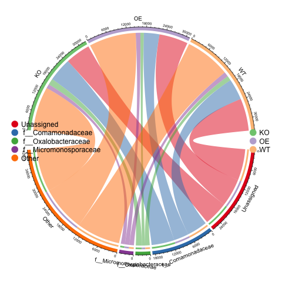

```{r setup, include=FALSE}
knitr::opts_chunk$set(echo = TRUE)
library(qiime2R)
library(tidyverse)
library(phyloseq)
```


## 导入数据
```{r, include=FALSE}
metadata <- read.table("test/metadata.txt", header=T, row.names=1, sep="\t", 
                       comment.char="", stringsAsFactors=F)
table <- read_qza("test/table.qza")$data %>% as.data.frame()
taxonomy <- read_qza("test/taxonomy.qza")$data %>% as.data.frame() %>%
  column_to_rownames("Feature.ID")
temp <- unlist(str_split(taxonomy$Taxon, ";", simplify = TRUE)) %>% as.data.frame()
colnames(temp) <- c("Kingdom", "Phylum", "Class", "Order",	"Family",	"Genus", "Species")
rownames(temp) <- rownames(taxonomy)
taxonomy <- temp
for (i in c(" p__", " c__", " o__", " f__", " g__", " s__", "")){
    taxonomy[taxonomy == i] <- "Unassigned"
}
```


## 物种注释
### stack plot
```{r}
source("taxonomy/tax_stackplot.R")
library(RColorBrewer)
# 选择分类水平
tax <- table %>% mutate(tax = taxonomy[rownames(table), "Family"]) %>%
    group_by(tax) %>% summarise_all(list(sum)) %>% column_to_rownames("tax")

# 门水平物种组成表和元数据作为输入，分组列名为Group，默认显示前8个分类，按丰度排序
p1 <- tax_stackplot(tax, metadata, groupID="Group", topN=10) +
                    scale_fill_brewer(palette="Set3")
zoom=1.2 # 控制图片缩放比例
# 输出图片
# ggsave(paste0("p1.stackplot.group.jpg"), p, width=89*zoom, height=56*zoom, units="mm")
p1

# topN指定图例数量，style指定类型为样本/分组，排序可选字母
p2 <- tax_stackplot(tax, metadata, groupID="Group", topN=10, 
                    style="sample", sorted="alphabet") +
                    scale_fill_brewer(palette="Set3")
# 保存图片
zoom=1.5 # 控制图片缩放比例
# ggsave(paste0("p2.stackplot.sample.jpg"), p, width=89*zoom, height=56*zoom, units="mm")
p2
```
### stack clust
```{r}
source("taxonomy/tax_stack_clust.R")
result <- tax_stack_clust(otu=table, tax=taxonomy, map=metadata,
                          rep=6, # 重复数量是6个
                          Top=10, # 提取丰度前十的物种注释
                          tran=TRUE, # 转化为相对丰度值
                          j="Family", 
                          dist="bray", hcluter_method="complete",
                          cuttree=3,
                          Group="Group")
p1 <- result[[1]]
p2 <- result[[2]]
p3 <- result[[3]]

zoom=2 # 控制图片缩放比例
# 输出图片
# ggsave(paste0("p7.stack_cluster.sample.jpg"), p, width=89*zoom, height=56*zoom, units="mm")
p2
```
### circlize
```{r}
source("taxonomy/tax_circlize.R")
tax <- table %>% mutate(tax = taxonomy[rownames(table), "Family"]) %>%
    group_by(tax) %>% summarise_all(list(sum)) %>% column_to_rownames("tax")

tax_circlize(tax_sum=tax, metadata, topN=5, groupID="Group")

```

### ternary plot
```{r}
source("taxonomy/ternary_plot.R")
p <- ternary_plot(otu = table, map = metadata, tax = taxonomy, list_group = c("OE", "KO", "WT"),
                  j = "Family", Top = 15)

zoom=1.5 # 控制图片缩放比例
# ggsave(paste0("tax_alluvial.jpg"), p, width=89*zoom, height=56*zoom, units="mm")
p
```
### alluvial diagram
```{r}
source("taxonomy/tax_alluvial_diagram.R")
p <- tax_alluvial(otu = table, map = metadata, tax = taxonomy, list_group = c("OE", "KO"),
                  j = "Phylum", Top = 10)

zoom=1.5 # 控制图片缩放比例
# ggsave(paste0("tax_alluvial.jpg"), p, width=89*zoom, height=56*zoom, units="mm")
p
```
## 多样性
### alpha
```{r}
library(Hmisc)
source("alpha/alpha_diversity.R")
observed_features <- read_qza("test/core-metrics-results/observed_features_vector.qza")$data %>% as.data.frame()
shannon <- read_qza("test/core-metrics-results/shannon_vector.qza")$data %>% as.data.frame()
evenness <- read_qza("test/core-metrics-results/evenness_vector.qza")$data %>% as.data.frame()
faith <- read_qza("test/core-metrics-results/faith_pd_vector.qza")$data %>% as.data.frame()
alpha_div <- cbind(observed_features, shannon) %>% cbind(evenness) %>% cbind(faith)
colnames(alpha_div) = capitalize(colnames(alpha_div))
colnames(alpha_div)
#> [1] "Observed_features" "Shannon_entropy"   "Pielou_evenness"   "Faith_pd"   

# Plotting alpha diversity Richness boxplot and stat
p = alpha_boxplot(alpha_div, index = "Observed_features", metadata, groupID = "Group")
p
```

### beta 
#### PERMANOVA
```{r}
library(vegan)
# 主坐标轴分析，可选距离矩阵bray_curtis、unifrac、unifrac_binary、jaccard、manhatten、euclidean
# 设置距离矩阵类似，常用bray_curtis或unifrac
distance_type <- "bray_curtis"
# Data reading
distance_mat <- read_qza("test/core-metrics-results/bray_curtis_distance_matrix.qza")$data %>% as.matrix() %>% as.data.frame()

# 仅查看分组对群落的解释
adonis_var <- adonis (as.dist(distance_mat) ~ Group, data = metadata, by=NULL, parallel=4)
adonis_var$aov.tab

# write.table(adonis_var$aov.tab, file="beta/adonis_var_group.txt", append = F, sep="\t", quote=F, row.names=T, col.names=T)

# 计算Group, Date, Site三类变量及交互对群落结构差异的解释
adonis_var <- adonis(as.dist(distance_mat) ~ Group*Date*Site, data = metadata, by=NULL, parallel=4)
adonis_var$aov.tab

# 变量不能重合，否则无效。如本次Date与Site一致，所以Site无结果
# 计算Group和Site的解释率
adonis_var <- adonis(as.dist(distance_mat) ~ Group*Site, data = metadata, by=NULL, parallel=4)
adonis_var$aov.tab

# write.table(adonis_var$aov.tab, file="beta/adonis_var.txt", append = F, sep="\t", quote=F, row.names=T, col.names=T)
```

#### adonis
```{r}
source("beta/adonis.R")
distance_mat <- read_qza("test/core-metrics-results/bray_curtis_distance_matrix.qza")$data %>% as.matrix() %>% as.data.frame()
comparison_adonis(distance_mat, group_list=c("KO", "OE", "WT"), metadata)
```

### pcoa
```{r}
source("beta/beta_pcoa.R")
distance_type = "bray_curtis"
# Data reading
distance_mat <- read_qza("test/core-metrics-results/bray_curtis_distance_matrix.qza")$data %>% as.matrix() %>% as.data.frame()

p = beta_pcoa(distance_mat, metadata, groupID = "Group")

# 展示样本标签 Display sample label
p = beta_pcoa(distance_mat, metadata, groupID = "Group", label = T)
p
```

### difference analysis
#### MaAsLin2
```{r}
library(Maaslin2)
input_data <- table %>% t() %>% as.data.frame()
fit_data7 = Maaslin2(
    input_data = input_data, 
    input_metadata = metadata, 
    fixed_effects = "Group",
    random_effects = "Site",
    reference = c("Group", "Site"),
    normalization = "CLR", 
    output = "test/maaslin_out", 
    analysis_method = "LM",
    min_prevalence = 0.1,
    min_abundance = 0.0001)
```
#### Ancombc
```{r}
library(ANCOMBC)
library(phyloseq)
library(tidyverse)
tse <- phyloseq(sample_data(metadata),otu_table(as.matrix(table), taxa_are_rows=TRUE), tax_table(as.matrix(taxonomy)))
output = ancombc2(data = tse, assay_name = "counts", tax_level = NULL,
                  fix_formula = "Group", rand_formula = NULL,
                  p_adj_method = "holm", pseudo = 0, pseudo_sens = TRUE,
                  prv_cut = 0.10, lib_cut = 1000, s0_perc = 0.05,
                  group = "Group", struc_zero = TRUE, neg_lb = TRUE,
                  alpha = 0.05, n_cl = 2, verbose = TRUE,
                  global = TRUE, pairwise = TRUE, dunnet = TRUE, trend = TRUE,
                  iter_control = list(tol = 1e-2, max_iter = 20, 
                                      verbose = TRUE),
                  em_control = list(tol = 1e-5, max_iter = 100),
                  lme_control = lme4::lmerControl(),
                  mdfdr_control = list(fwer_ctrl_method = "holm", B = 100),
                  trend_control = list(contrast = list(matrix(c(1, 0, -1, 1),
                                                              nrow = 2, 
                                                              byrow = TRUE),
                                                       matrix(c(-1, 0, 1, -1),
                                                              nrow = 2, 
                                                              byrow = TRUE)),
                                       node = list(2, 2),
                                       solver = "ECOS",
                                       B = 100))
res_pair = output$res_pair
write.csv("path.")
df_fig_pair = res_pair %>%
  filter(diff_GroupOE == 1 | diff_GroupWT == 1 |
           diff_GroupWT_GroupOE == 1) %>%
  mutate(lfc_OE = ifelse(diff_GroupOE == 1, 
                           lfc_GroupOE, 0),
         lfc_WT = ifelse(diff_GroupWT == 1, 
                                 lfc_GroupWT, 0),
         lfc_WT_OE = ifelse(diff_GroupWT_GroupOE == 1, 
                                      lfc_GroupWT_GroupOE, 0)) %>%
  transmute(taxon, 
            `OE vs. KO` = round(lfc_OE, 2), 
            `WT vs. KO` = round(lfc_WT, 2),
            `WT vs. OE` = round(lfc_WT_OE, 2)
  ) %>%
  pivot_longer(cols = `OE vs. KO`:`WT vs. OE`, 
               names_to = "group", values_to = "value") %>%
  arrange(taxon)
df_fig_pair$group = factor(df_fig_pair$group, 
                           levels = c("OE vs. KO",
                                      "WT vs. KO",
                                      "WT vs. OE"))

lo = floor(min(df_fig_pair$value))
up = ceiling(max(df_fig_pair$value))
mid = (lo + up)/2
fig_pair = df_fig_pair %>%
  ggplot(aes(x = group, y = taxon, fill = value)) + 
  geom_tile(color = "black") +
  scale_fill_gradient2(low = "blue", high = "red", mid = "white", 
                       na.value = "white", midpoint = mid, limit = c(lo, up),
                       name = NULL) +
  geom_text(aes(group, taxon, label = value), color = "black", size = 4) +
  labs(x = NULL, y = NULL, title = "Log fold change of pairwise comparisons") +
  theme_minimal() +
  theme(plot.title = element_text(hjust = 0.5))
fig_pair
```

### metwork 
```{r}
library(SpiecEasi)
```


### 功能注释
#### pathyway, heatmap
```{r, message=FALSE}
library(pheatmap)
metacyc_pathway <- read.csv("test/picrust2_out_pipeline/pathways_out/path_abun_unstrat_descrip.tsv", sep = "\t") %>%
  select(-description) %>% column_to_rownames("pathway")
sample_sum <- colSums(metacyc_pathway)
metacyc_pathway <- metacyc_pathway / sample_sum
pheatmap(log(metacyc_pathway+1), show_rownames=FALSE)
```
#### metacyc PCA
```{r}
library(ggrepel)
function_pca <- prcomp(t(metacyc_pathway), scale.=TRUE)
points <- function_pca$x[,1:2]
colnames(points)=c("x", "y")
# #提取荷载坐标
# otu.pca$rotation
# 提取解释度,这里提供的并不是特征值而是标准差，需要求其平方才是特征值
eig=function_pca$sdev
eig=eig*eig

points=cbind(points, metadata[match(rownames(points), rownames(metadata)), ])
# head(points)
points$ID=row.names(points)
colbar <- length(unique(metadata$Group))
mi=colorRampPalette(c( "#CBD588", "#599861", "orange","#DA5724", "#508578", "#CD9BCD","#AD6F3B", "#673770","#D14285", "#652926", "#C84248","#8569D5", "#5E738F","#D1A33D", "#8A7C64","black"))(colbar)

p1 <- ggplot(points, aes(x=x, y=y, fill=Group)) +
    geom_point(alpha=.7, size=2, pch=21) +
    labs(x=paste0("PCA 1 (",format(100*eig[1]/sum(eig),digits=4),"%)"),
         y=paste0("PCA 2 (",format(100*eig[2]/sum(eig),digits=4),"%)")) +
    stat_ellipse(linetype=2,level=0.68, aes(group=Group, colour=Group))+
    scale_colour_manual(values=mi,guide=guide_legend(title=NULL))+
    scale_fill_manual(values=mi,guide=guide_legend(title=NULL))+
    guides(color=guide_legend(title=NULL),shape=guide_legend(title=NULL))
p2=p1+theme_bw()+
    geom_hline(aes(yintercept=0), colour="black", linetype=2) +
    geom_vline(aes(xintercept=0), colour="black", linetype="dashed")
p3=p2+geom_text_repel(aes(label=points$ID),size=2)
p3
```

#### differece function
```{r}
input_data <- metacyc_pathway %>% t() %>% as.data.frame()
fit_data7 = Maaslin2(
    input_data = input_data, 
    input_metadata = metadata, 
    fixed_effects = "Group",
    random_effects = "Site",
    reference = c("Group", "Site"),
    normalization = "CLR", 
    output = "test/maaslin_function_out", 
    analysis_method = "LM",
    min_prevalence = 0.1,
    min_abundance = 0.0001)
```

