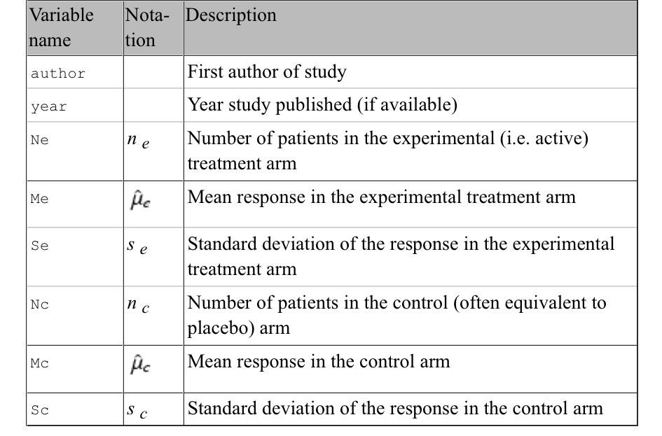

```{r setup, include=FALSE}
knitr::opts_chunk$set(echo = TRUE)
```

```{r}
# pkgs <- c("mada", "meta", "metafor", "metasens", "mvmeta", "netmeta",
#           "rmeta", "ellipse")
# install.packages(pkgs, repos="http://cran.at.r-project.org/")
```

# Standard Methods
## 1 Fixed Effect and Random Effects Meta-Analysis
### 1.1 Effect Measures for Continus Outcomes
Variable names in R datasets for meta-analysis of continuous responses

```{r figname, echo=FALSE, fig.cap="variable name", out.width = '100%'}

```
#### **1.1.1 Mean Difference**
THe estimated mean difference $\hat \mu_k = \hat \mu_{ek} - \hat \mu_{ck}$  
variance estimate : $Var(\hat \mu_k) = \frac {s_{ek}^2}{n_{ek}} + \frac {s_{ck}^2}{n_ck}$
An approximate two-sided (1 - $\alpha$) confidence interval for the mean difference  
is given by $(\hat \mu_{ek} - \hat \mu_{ck}) = Z_{1 - \frac {\alpha}{2}} \sqrt {\frac {s_{ek}^2}{n_{ek}} + \frac {s_{ck}^2}{n_ck}}$

```{r}
# 1. Read in the data
library(meta)
data1 <- read.csv("data/dataset01.csv", as.is=TRUE)
# 2. Calculate mean difference and its standard error for
#    study 1 (Boner 1988) of dataset data1:
MD <- with(data1[1,], Me - Mc)
seMD <- with(data1[1,], sqrt(Se^2/Ne + Sc^2/Nc))
# 3. Print mean difference and limits of 95% confidence
#    interval using round function to show only two digits:
# base R
round(c(MD, MD + c(-1,1) * qnorm(1-(0.05/2)) * seMD), 2)
with(data1[1, ],
     print(metacont(Ne, Me, Se, Nc, Mc, Sc),
           digits=2))
# print(metacont(Ne, Me, Se, Nc, Mc, Sc,
#                data=data1, subset=1), digits=2)
zscore <- MD/seMD
round(c(zscore, 2*pnorm(abs(zscore), lower.tail=FALSE)), 4)
```
#### **1.1.2 Standardised Mean Difference**
In many settings differences in the individual studies
SDM : $\hat g_K = (1 - \frac {3}{4n_k - 9}) \frac {\hat \mu_{ek} - \hat \mu_{ck}}{\sqrt ((n_{ek} - 1)s_{ek}^2 + (n_{ck} -1)s_{ck}^2)/(n_{k} - 2)}$  
variance : $Var(\hat g_k) = \frac {n_k}{n_{ek}\times{n_{ck}}} + \frac {\hat g_k^2}{2(n_k - 3.94)}$  
confidence interval : $\hat g_k \pm Z_{1 - \frac {\alpha}{2}} \sqrt Var(\hat g_k)$

```{r}
# 1. Read in the data:
data2 <- read.csv("data/dataset02.csv")
# 2. As usual, to view an object, type its name:
data2
# 3. Calculate total sample sizes
summary(data2$Ne+data2$Nc)
# 1. Calculate standardised mean difference (SMD) and
#    its standard error (seSMD) for study 1 (Blashki) of
#    dataset data2:
N <- with(data2[1,], Ne + Nc)
SMD <- with(data2[1,],
            (1 - 3/(4 * N - 9)) * (Me - Mc) /
            sqrt(((Ne - 1) * Se^2 + (Nc - 1) * Sc^2)/(N - 2)))
seSMD <- with(data2[1,],
              sqrt(N/(Ne * Nc) + SMD^2/(2 * (N - 3.94))))
# 2. Print standardised mean difference and limits of 95% CI
#    interval using round function to show only two digits:
round(c(SMD, SMD + c(-1,1) * qnorm(1-(0.05/2)) * seSMD), 2)
print(metacont(Ne, Me, Se, Nc, Mc, Sc, sm="SMD",
               data=data2, subset=1), digits=2)
```

### **1.2 Fixed Effect Model**  
The fixed effect model is  
$\hat \theta_k = \theta + \sigma_k \epsilon_k$, $\epsilon_k \sim N(0,1)$  
Fix effect estimate :  
$\hat \theta_k = \frac {\displaystyle \sum^{K}_{k=1} \hat \theta_k / \sigma_k^2}{\displaystyle \sum^{K}_{k=1} 1 / \sigma_k^2} = \frac {\displaystyle \sum^{K}_{k=1} \hat \theta_k w_k}{\displaystyle \sum^{K}_{k=1} w_k}$  
The variance of $\hat \theta_F$ is estimated by:  
$Var(\hat \theta_F) = \frac {1}{\sum^{K}_{k=1} w_k}$  
$(1 - \alpha)$ confidence interval for $\hat \theta_F$:
$\hat \theta_F \pm Z_{1 - \frac {\alpha}{2}} S.E.(\hat \theta_F)$  

The fixed effect estimate $\hat \theta_F$ and its variance can be calculated  
using the following quantities:  
$\hat \theta_k = \hat \mu_k$  
$\sigma_k^2 = Var(\hat \mu_k)$  

```{r}
# 1. Calculate mean difference, variance and weights
MD <- with(data1, Me - Mc)
varMD <- with(data1, Se^2/Ne + Sc^2/Nc)
weight <- 1/varMD
# 2. Calculate the inverse variance estimator
round(weighted.mean(MD, weight), 4)
# 3. Calculate the variance
round(1/sum(weight), 4)

# Calculate with metaR
mc1 <- metacont(Ne, Me, Se, Nc, Mc, Sc,
                data=data1,
                studlab=paste(author, year))
round(c(mc1$TE.fixed, mc1$seTE.fixed^2), 4)
print(mc1, digits=1)

# The weight of study
mc1$w.fixed[1]
sum(mc1$w.fixed)
round(100*mc1$w.fixed[1] / sum(mc1$w.fixed), 2)

forest(mc1, comb.random=FALSE, xlab=
       "Difference in mean response (intervention - control)
units: maximum % fall in FEV1",
       xlim=c(-50,10), xlab.pos=-20, smlab.pos=-20)

# 1. Apply generic inverse variance method
mc1.gen <- metagen(mc1$TE, mc1$seTE, sm="MD")
# 2. Same result
mc1.gen <- metagen(TE, seTE, data=mc1, sm="MD")
# 3. Print results for fixed effect and random effects method
c(mc1$TE.fixed, mc1$TE.random)
c(mc1.gen$TE.fixed, mc1.gen$TE.random)

# 1. Calculate standardised mean difference,
#    variance and weights
N <- with(data2, Ne + Nc)
SMD <- with(data2,
            (1 - 3/(4 * N - 9)) * (Me - Mc)/
            sqrt(((Ne - 1) * Se^2 + (Nc - 1) * Sc^2)/(N - 2)))
varSMD <- with(data2,
               N/(Ne * Nc) + SMD^2/(2 * (N - 3.94)))
weight <- 1/varSMD
# 2. Calculate the inverse variance estimator
round(weighted.mean(SMD, weight), 4)
# 3. Calculate the variance
round(1/sum(weight), 4)

mc2 <- metacont(Ne, Me, Se, Nc, Mc, Sc, sm="SMD",
                data=data2)
round(c(mc2$TE.fixed, mc2$seTE.fixed^2), 4)

print(summary(mc2), digits=2)
```

### **1.3 Random Effects Model**
more variable than assumed in fixed model  
$\hat \theta_k = \theta +u + \sigma_k \epsilon_k$, $\epsilon_k \sim N(0, 1), u_k \sim N(0, \tau^2)$  
$Q = \displaystyle \sum^{K}_{k=1} w_k (\hat \theta_k - \hat \theta_r)^2$  
$S = \displaystyle \sum^{K}_{k=1} w_k - \frac {\displaystyle \sum^{K}_{k=1}w_k^2}{\displaystyle \sum^{K}_{k=1}w_k}$  
if $Q < (K - 1)$, then $\hat \tau^2$ is set to 0 and random effects estimate $\hat \theta_R$  
is set equal to fixed effect estimate $\hat \theta_F$.  
$\hat \tau^2 = \frac {Q - (K - 1)}{S}$  
random effects estimate (DerSimonian-Laird):
$\hat \theta_R = \frac {\displaystyle \sum^{K}_{k=1} w^*_k \hat \theta_k}{\displaystyle \sum^{K}_{k=1} w^*_k}$  
$Var(\hat \theta_R) = \frac {1}{\displaystyle \sum^{K}_{k=1} w^*_k}$, with weight $w^*_k = 1 / (\sigma^2_k + \hat \tau^2)$  
confidence interval for $\hat \theta_R$:
$\hat \theta_R \pm Z_{1 - \frac {\alpha}{2} S.E.(\hat \theta_R)}$  
